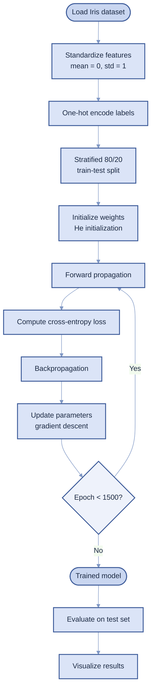
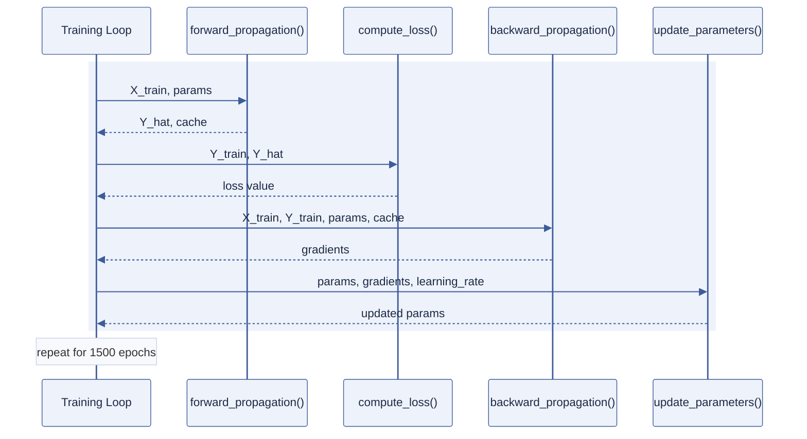
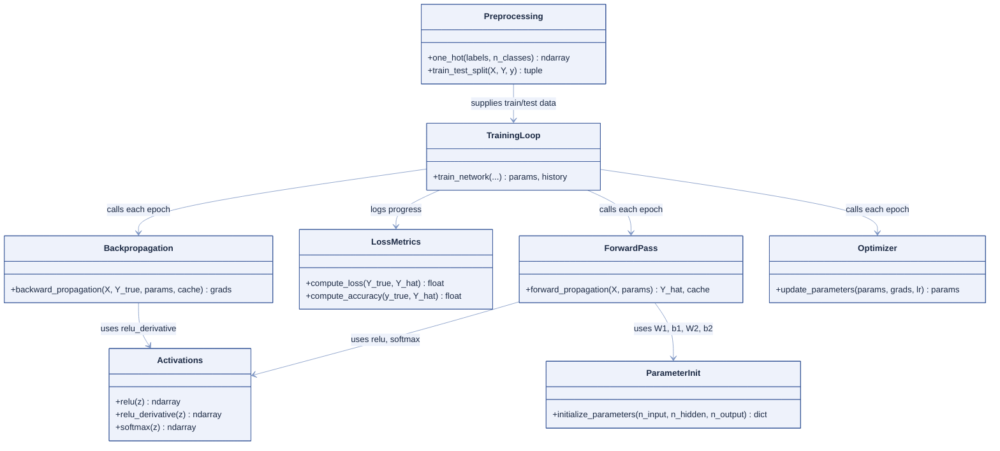

# Neural Network from Scratch — Iris Species Classification

<p>
A complete, from-first-principles implementation of a feedforward neural network — built using only <b>NumPy</b>, with no TensorFlow, PyTorch, or Keras — trained to classify Iris flowers into one of three species.
</p>

| | |
|---|---|
| **Course** | Generative AI Lab |
| **Department** | CSE (AIML) |
| **Assignment** | Practice Lab Assignment 1 — Neural Network Implementation from Scratch |
| **Author** | Manmath Kornule |
| **Language** | Python 3 (NumPy, Matplotlib, scikit-learn for data only) |

---

## Table of Contents

1. [Introduction](#1-introduction)
2. [Dataset](#2-dataset)
3. [Network Architecture](#3-network-architecture)
4. [Mathematical Foundations](#4-mathematical-foundations)
5. [Training Pipeline](#5-training-pipeline)
6. [Repository Structure](#6-repository-structure)
7. [Code Design (UML)](#7-code-design-uml)
8. [Getting Started](#8-getting-started)
9. [Results & Visualizations](#9-results--visualizations)
10. [Design Decisions & Limitations](#10-design-decisions--limitations)
11. [Possible Extensions](#11-possible-extensions)
12. [References](#12-references)
13. [License](#13-license)

---

## 1. Introduction

This repository contains a Jupyter notebook that implements every stage of a feedforward neural network by hand: parameter initialization, the forward pass, the loss function, backpropagation, and gradient-descent optimization. It is trained on the well-known **Iris flower dataset** to solve a three-class classification problem.

Every matrix multiplication and every gradient is written out explicitly using NumPy, so the underlying mechanics of how the network learns are fully visible, traceable, and easy to reason about.

---

## 2. Dataset

The project uses the **Iris dataset**, a small, well-balanced, classic benchmark for classification.

| Property | Detail |
|---|---|
| Source | UCI Machine Learning Repository, loaded via `sklearn.datasets.load_iris()` |
| Total samples | 150 |
| Features | 4 — sepal length, sepal width, petal length, petal width (all in cm) |
| Classes | 3 — *Setosa*, *Versicolor*, *Virginica* (50 samples each, perfectly balanced) |
| Problem type | Multi-class classification |

> **Note:** `scikit-learn` is used strictly as a data-loading and train/test-splitting utility. No model, layer, optimizer, or loss function from any machine-learning library is used anywhere in the implementation.

---

## 3. Network Architecture

The network is a single-hidden-layer feedforward architecture:

```
Input Layer (4 neurons)  →  Hidden Layer (8 neurons, ReLU)  →  Output Layer (3 neurons, Softmax)
```



```mermaid
%%{init: {'theme': 'base', 'themeVariables': {
  'primaryColor': '#eef2fb',
  'primaryBorderColor': '#3E5C9A',
  'primaryTextColor': '#1c2a44',
  'lineColor': '#7f97c4',
  'background': '#ffffff',
  'clusterBkg': '#f7f9fd',
  'clusterBorder': '#c7d2e8',
  'fontFamily': 'Segoe UI, sans-serif'
}}}%%
flowchart LR
    subgraph Input["Input Layer — 4 neurons"]
        i1((Sepal length))
        i2((Sepal width))
        i3((Petal length))
        i4((Petal width))
    end
    subgraph Hidden["Hidden Layer — 8 neurons, ReLU"]
        h1((h1)); h2((h2)); h3((h3)); h4((h4))
        h5((h5)); h6((h6)); h7((h7)); h8((h8))
    end
    subgraph Output["Output Layer — 3 neurons, Softmax"]
        o1((Setosa))
        o2((Versicolor))
        o3((Virginica))
    end
    Input --> Hidden --> Output

    classDef nodeStyle fill:#dbe4f7,stroke:#3E5C9A,stroke-width:2px,color:#1c2a44;
    classDef subgraphStyle fill:#f7f9fd,stroke:#c7d2e8,stroke-width:1.5px,color:#1c2a44;
    class i1,i2,i3,i4,h1,h2,h3,h4,h5,h6,h7,h8,o1,o2,o3 nodeStyle;
    class Input,Hidden,Output subgraphStyle;
```

| Layer | Neurons | Activation | Role |
|---|---|---|---|
| Input | 4 | — | Standardized flower measurements |
| Hidden | 8 | ReLU | Learns non-linear combinations of the input features |
| Output | 3 | Softmax | Converts raw scores into class probabilities |

**Parameter shapes**

| Parameter | Shape | Description |
|---|---|---|
| `W1` | (4, 8) | Input → Hidden weights |
| `b1` | (1, 8) | Hidden layer biases |
| `W2` | (8, 3) | Hidden → Output weights |
| `b2` | (1, 3) | Output layer biases |

---

## 4. Mathematical Foundations

### 4.1 Forward Propagation

$$Z_1 = XW_1 + b_1 \qquad A_1 = \text{ReLU}(Z_1)$$

$$Z_2 = A_1 W_2 + b_2 \qquad \hat{Y} = \text{Softmax}(Z_2)$$

In plain terms: the input is weighted and summed, passed through ReLU (negative values become zero), weighted and summed again, then passed through Softmax to produce a probability for each species.

### 4.2 Activation Functions

$$\text{ReLU}(z) = \max(0, z) \qquad \text{Softmax}(z)_k = \frac{e^{z_k}}{\sum_j e^{z_j}}$$

### 4.3 Loss Function — Categorical Cross-Entropy

$$\mathcal{L} = -\frac{1}{m}\sum_{i=1}^{m}\sum_{k=1}^{3} y_{ik}\log(\hat y_{ik})$$

This penalizes the network more heavily the more confidently wrong its prediction is.

### 4.4 Backpropagation

Because Softmax and cross-entropy are paired, the output-layer gradient simplifies neatly:

$$dZ_2 = \hat Y - Y$$

$$dW_2 = A_1^{T}dZ_2 \qquad db_2 = \sum dZ_2$$

$$dZ_1 = (dZ_2\, W_2^{T}) \odot \text{ReLU}'(Z_1) \qquad dW_1 = X^{T}dZ_1 \qquad db_1 = \sum dZ_1$$

### 4.5 Parameter Update — Gradient Descent

$$\theta \leftarrow \theta - \eta \frac{\partial \mathcal{L}}{\partial \theta}$$

where $\eta$ is the learning rate (0.1 in this project).

---

## 5. Training Pipeline



### Sequence of one training epoch



---

## 6. Repository Structure

```
.
├── Manmath_Kornule_GenerativeAILabAssignment.ipynb   Main notebook: code, math, and visualizations
├── README.md                                          Project documentation (this file)
└── requirements.txt                                   Python dependencies
```

---

## 7. Code Design (UML)

The notebook favors small, single-purpose functions over one monolithic class, so each stage of the pipeline can be tested and read independently.



| Module | Responsibility |
|---|---|
| `Preprocessing` | Standardizes features, one-hot encodes labels, splits data |
| `Activations` | ReLU, its derivative, and Softmax |
| `ParameterInit` | He-initialized weights and zero biases |
| `ForwardPass` | Computes predictions and caches intermediate values |
| `LossMetrics` | Cross-entropy loss and accuracy calculations |
| `Backpropagation` | Computes gradients for every weight and bias |
| `Optimizer` | Applies a gradient-descent update step |
| `TrainingLoop` | Orchestrates the full training process across epochs |

---

## 8. Getting Started

### Prerequisites

- Python 3.9 or later
- `pip` package manager

### Installation

```bash
git clone <your-repo-url>
cd <your-repo-folder>
pip install -r requirements.txt
```

### Running the notebook

```bash
jupyter notebook Manmath_Kornule_GenerativeAILabAssignment.ipynb
```

Then select **Kernel → Restart & Run All**. The entire notebook — including training and every visualization — runs in well under a minute, with no GPU and no external dataset download required (the Iris dataset ships with `scikit-learn`).

### requirements.txt

```
numpy
matplotlib
scikit-learn
jupyter
```

---

## 9. Results & Visualizations

| Metric | Value |
|---|---|
| Test accuracy | approximately 95–100% (small variation depending on random seed / split) |
| Training epochs | 1500 |
| Learning rate | 0.1 |
| Loss function | Categorical cross-entropy |
| Optimizer | Full-batch gradient descent |

The notebook includes the following visual outputs:

- A pairwise feature scatter-and-histogram grid of the raw dataset
- A schematic diagram of the network architecture
- Training loss and accuracy curves, plotted for both the training and test sets
- A confusion matrix, plus a manually computed precision / recall / F1-score table
- Schematic per-flower diagrams comparing actual vs. predicted species on individual test samples
- A decision-boundary plot over the two most discriminative features (petal length and petal width)

---

## 10. Design Decisions & Limitations

| Decision | Reasoning |
|---|---|
| Full-batch gradient descent | Simpler to implement and reason about; the dataset is small enough to fit comfortably in memory each step |
| No regularization (L2, dropout) | Not necessary on a dataset this small and well-balanced |
| Single hidden layer | Sufficient capacity for a near-linearly-separable dataset like Iris |
| He initialization | Well suited to ReLU activations; prevents vanishing/exploding signals early in training |

**Known limitations**

- Convergence speed would suffer on a larger or noisier dataset without a more advanced optimizer such as Adam or RMSProp
- No built-in early stopping or learning-rate scheduling
- Mini-batch training was intentionally omitted for simplicity, since it is not required at this dataset size

---

## 11. Possible Extensions

- Add a second hidden layer and compare performance
- Implement Adam or momentum-based gradient descent
- Add L2 regularization and observe its effect on the decision boundary
- Extend to a larger, noisier dataset (e.g. MNIST) to test scalability
- Package the functions into a reusable `NeuralNetwork` class

---

## 12. References

- Fisher, R.A. (1936). *The Use of Multiple Measurements in Taxonomic Problems* — original Iris dataset paper
- Goodfellow, I., Bengio, Y., Courville, A. — *Deep Learning* (MIT Press) — background on backpropagation and gradient-based optimization
- `scikit-learn` documentation — dataset loading and train/test splitting utilities

---

## 13. License

This project was created for academic purposes as part of Generative AI Lab coursework. It may be referenced or adapted for learning purposes.
