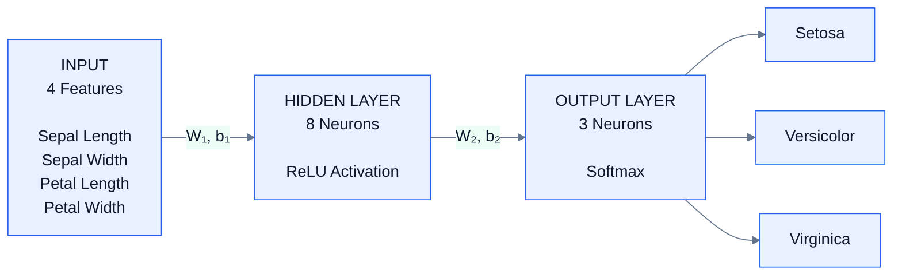
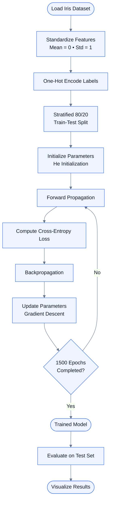
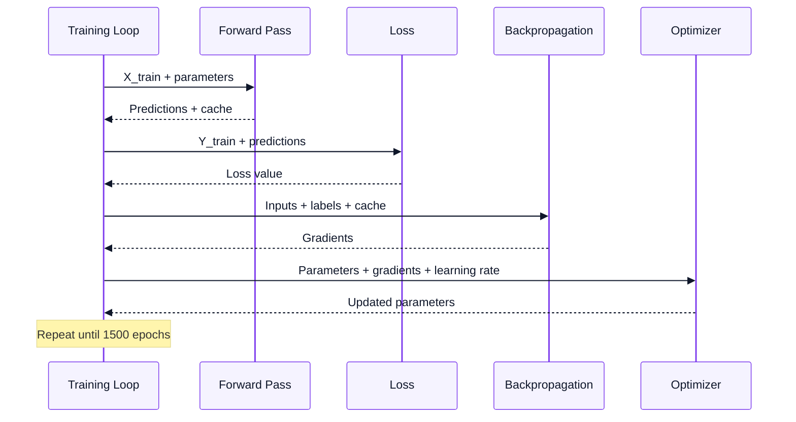
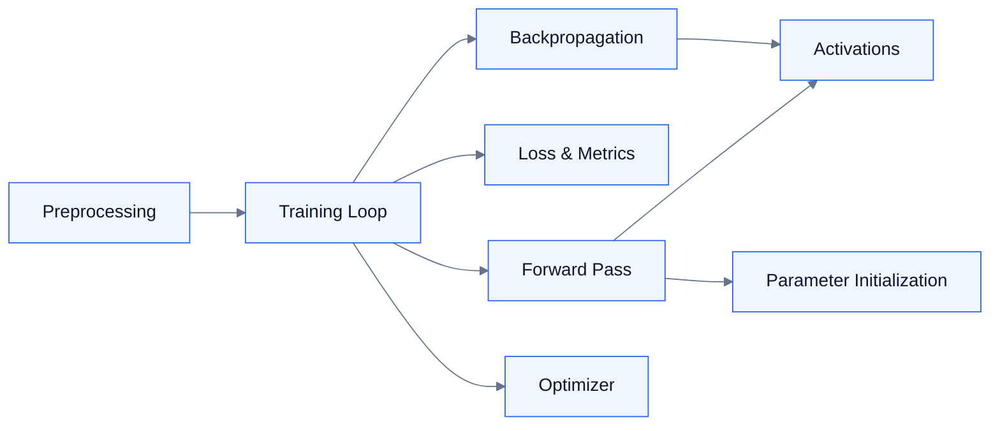

# Neural Network from Scratch
### Iris Species Classification using NumPy

<p align="center">
  <strong>A from-scratch feedforward neural network built with NumPy</strong><br>
  <sub>No TensorFlow • No PyTorch • No Keras • Fully transparent forward pass, backpropagation, and optimization</sub>
</p>

---

## Project Overview

This project implements a **feedforward neural network from first principles** using **NumPy** and trains it to classify Iris flowers into three species: **Setosa, Versicolor, and Virginica**.

Rather than relying on a high-level `.fit()` API, the implementation explicitly performs:

- Parameter initialization
- Forward propagation
- ReLU activation
- Softmax classification
- Categorical cross-entropy loss
- Backpropagation
- Gradient-descent optimization
- Model evaluation and visualization

The result is a compact implementation designed to make the mathematics and mechanics of neural-network learning **visible, understandable, and easy to audit**.

> **Course:** Generative AI Lab  
> **Department:** CSE (AIML)  
> **Assignment:** Practice Lab Assignment 1 — Neural Network Implementation from Scratch  
> **Author:** Manmath Kornule  
> **Language:** Python 3

---

## Table of Contents

1. [Why Build a Neural Network from Scratch?](#1-why-build-a-neural-network-from-scratch)
2. [Dataset](#2-dataset)
3. [Network Architecture](#3-network-architecture)
4. [Mathematical Foundations](#4-mathematical-foundations)
5. [Training Pipeline](#5-training-pipeline)
6. [Repository Structure](#6-repository-structure)
7. [Code Design](#7-code-design)
8. [Getting Started](#8-getting-started)
9. [Results & Visualizations](#9-results--visualizations)
10. [Design Decisions & Limitations](#10-design-decisions--limitations)
11. [Possible Extensions](#11-possible-extensions)
12. [References](#12-references)
13. [License](#13-license)

---

# 1. Why Build a Neural Network from Scratch?

Building the network without a deep-learning framework makes the underlying learning process explicit.

| Benefit | Why it matters |
|---|---|
| **Conceptual clarity** | Makes forward propagation, loss computation, and backpropagation explicit instead of hiding them behind a framework. |
| **Easy debugging** | Intermediate weighted sums, activations, losses, and gradients can be inspected directly. |
| **Framework-independent understanding** | The same mathematical foundations are used by modern frameworks such as PyTorch, TensorFlow, and JAX. |
| **Full control** | Architecture, initialization, activation functions, and optimization are directly implemented and configurable. |

---

# 2. Dataset

The project uses the classic **Iris dataset**, a small and well-balanced dataset for multi-class classification.

| Property | Details |
|---|---|
| **Source** | UCI Machine Learning Repository via `sklearn.datasets.load_iris()` |
| **Total samples** | 150 |
| **Input features** | 4 |
| **Features** | Sepal length, sepal width, petal length, petal width |
| **Classes** | Setosa, Versicolor, Virginica |
| **Samples per class** | 50 |
| **Problem type** | Multi-class classification |

### Data Preparation

The data pipeline consists of:

```text
Raw Iris Data
     │
     ▼
Standardize Features
     │
     ▼
One-Hot Encode Labels
     │
     ▼
Stratified 80/20 Train-Test Split
     │
     ├──────────────► Training Set
     │
     └──────────────► Test Set
```

> **Important:** `scikit-learn` is used only for dataset loading and train/test splitting. The neural network itself does not use a machine-learning framework for its model, layers, loss, optimizer, or training procedure.

---

# 3. Network Architecture

The model uses a **single-hidden-layer feedforward neural network**.

### Architecture at a glance



### Layer Summary

| Layer | Neurons | Activation | Purpose |
|---|---:|---|---|
| **Input** | 4 | — | Receives standardized flower measurements |
| **Hidden** | 8 | ReLU | Learns non-linear combinations of input features |
| **Output** | 3 | Softmax | Produces class probabilities |

### Parameter Shapes

| Parameter | Shape | Description |
|---|---|---|
| `W1` | `(4, 8)` | Input → hidden weights |
| `b1` | `(1, 8)` | Hidden-layer biases |
| `W2` | `(8, 3)` | Hidden → output weights |
| `b2` | `(1, 3)` | Output-layer biases |

---

# 4. Mathematical Foundations

## 4.1 Forward Propagation

The network performs two affine transformations with a ReLU activation between them.

### Hidden layer

$$
Z_1 = XW_1 + b_1
$$

$$
A_1 = \operatorname{ReLU}(Z_1)
$$

### Output layer

$$
Z_2 = A_1W_2 + b_2
$$

$$
\hat{Y} = \operatorname{Softmax}(Z_2)
$$

In simple terms:

> **Input → weighted sum → ReLU → weighted sum → Softmax → class probabilities**

---

## 4.2 Activation Functions

### ReLU

$$
\operatorname{ReLU}(z)=\max(0,z)
$$

ReLU keeps positive values and converts negative values to zero.

### Softmax

$$
\operatorname{Softmax}(z_k)
=
\frac{e^{z_k}}
{\sum_j e^{z_j}}
$$

Softmax converts the output scores into probabilities whose sum is approximately 1.

---

## 4.3 Loss Function — Categorical Cross-Entropy

For three-class classification:

$$
\mathcal{L}
=
-\frac{1}{m}
\sum_{i=1}^{m}
\sum_{k=1}^{3}
y_{ik}\log(\hat{y}_{ik})
$$

The loss becomes larger when the model assigns a low probability to the correct class.

---

## 4.4 Backpropagation

Because **Softmax + categorical cross-entropy** are used together, the output gradient simplifies to:

$$
dZ_2=\hat{Y}-Y
$$

Then:

$$
dW_2=A_1^TdZ_2
$$

$$
db_2=\sum dZ_2
$$

For the hidden layer:

$$
dZ_1=(dZ_2W_2^T)\odot\operatorname{ReLU}'(Z_1)
$$

$$
dW_1=X^TdZ_1
$$

$$
db_1=\sum dZ_1
$$

---

## 4.5 Gradient Descent

Parameters are updated using:

$$
\theta
\leftarrow
\theta-\eta
\frac{\partial\mathcal{L}}{\partial\theta}
$$

where:

- $\theta$ = model parameter
- $\eta$ = learning rate
- $\frac{\partial\mathcal{L}}{\partial\theta}$ = gradient of the loss

**Learning rate used:** `0.1`

---

# 5. Training Pipeline

The complete training process can be visualized as follows:



## One Training Epoch



---

# 6. Repository Structure

```text
project/
│
├── Manmath_Kornule_GenerativeAILabAssignment.ipynb
│   └── Main notebook: implementation, mathematics & visualizations
│
├── README.md
│   └── Project documentation
│
└── requirements.txt
    └── Python dependencies
```

---

# 7. Code Design

The notebook follows a **modular functional design** rather than placing the entire implementation inside one large class. Each stage has a focused responsibility.



### Module Responsibilities

| Module | Responsibility |
|---|---|
| `Preprocessing` | Standardizes features, one-hot encodes labels, and creates train/test sets |
| `Activations` | Implements ReLU, its derivative, and Softmax |
| `ParameterInit` | Initializes He-scaled weights and zero biases |
| `ForwardPass` | Computes predictions and stores intermediate values for backpropagation |
| `LossMetrics` | Computes cross-entropy loss and accuracy |
| `Backpropagation` | Calculates gradients for every weight and bias |
| `Optimizer` | Applies gradient-descent updates |
| `TrainingLoop` | Coordinates the complete training process across epochs |

---

# 8. Getting Started

## Prerequisites

- Python **3.9 or later**
- `pip`
- Jupyter Notebook

## Installation

```bash
git clone <your-repo-url>
cd <your-repo-folder>
pip install -r requirements.txt
```

## Run the Notebook

```bash
jupyter notebook Manmath_Kornule_GenerativeAILabAssignment.ipynb
```

Then select:

**Kernel → Restart & Run All**

The notebook trains the model and generates the visualizations without requiring a GPU or an external dataset download.

## Dependencies

```text
numpy
matplotlib
scikit-learn
jupyter
```

---

# 9. Results & Visualizations

The supplied project reports the following configuration and performance:

| Metric | Value |
|---|---|
| **Test accuracy** | Approximately 95–100% |
| **Training epochs** | 1500 |
| **Learning rate** | 0.1 |
| **Loss function** | Categorical cross-entropy |
| **Optimizer** | Full-batch gradient descent |

> Accuracy can vary slightly depending on the random seed and train/test split.

### Included Visualizations

The notebook contains:

1. **Feature distribution grid** — pairwise feature scatter plots and histograms.
2. **Network architecture diagram** — visual representation of the neural network.
3. **Training curves** — training/test loss and accuracy over epochs.
4. **Confusion matrix** — class-level prediction performance.
5. **Precision / Recall / F1 table** — manually calculated evaluation metrics.
6. **Prediction examples** — actual vs. predicted species for individual test samples.
7. **Decision boundary** — classification regions using petal length and petal width.

---

# 10. Design Decisions & Limitations

## Key Design Decisions

| Decision | Reason |
|---|---|
| **Full-batch gradient descent** | Simple to implement and appropriate for the small Iris dataset. |
| **No regularization** | The dataset is small and well balanced, so L2 regularization and dropout were intentionally omitted. |
| **Single hidden layer** | Provides sufficient capacity for this relatively simple classification problem. |
| **He initialization** | Well suited to ReLU activations and helps maintain useful signal magnitudes during initialization. |

## Known Limitations

- Training would become less efficient on larger or noisier datasets without a more advanced optimizer such as Adam or RMSProp.
- The implementation does not include early stopping.
- Learning-rate scheduling is not implemented.
- Mini-batch training was intentionally omitted because of the small dataset size.

---

# 11. Possible Extensions

The project can be extended in several directions:

- Add a second hidden layer and compare performance.
- Implement momentum-based gradient descent or Adam.
- Add L2 regularization and analyze its effect on the decision boundary.
- Train on a larger dataset such as MNIST.
- Package the functions into a reusable `NeuralNetwork` class.
- Experiment with different hidden-layer sizes, learning rates, and initialization strategies.

---

# 12. References

1. Fisher, R. A. (1936). *The Use of Multiple Measurements in Taxonomic Problems* — original Iris dataset paper.
2. Goodfellow, I., Bengio, Y., & Courville, A. *Deep Learning*. MIT Press.
3. `scikit-learn` documentation — dataset loading and train/test splitting utilities.

---

# 13. License

This project was created for **academic purposes** as part of Generative AI Lab coursework.

It may be referenced or adapted for educational and learning purposes.

---

<p align="center">
  <sub>Built from first principles with NumPy • Generative AI Lab • CSE (AIML)</sub>
</p>
