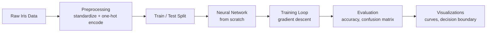
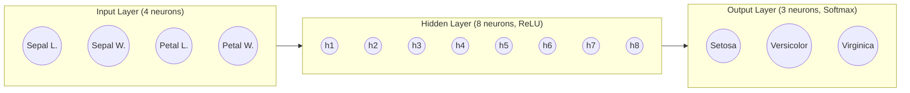
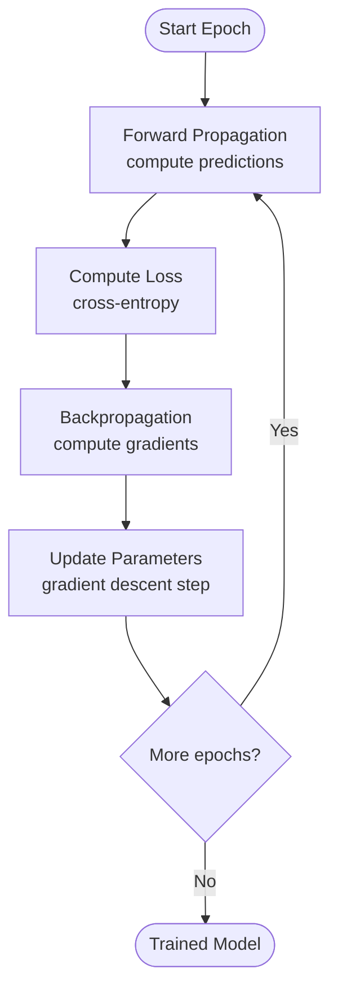
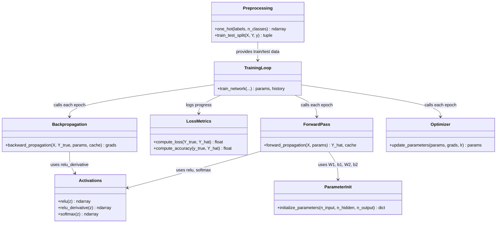

# Neural Network from Scratch — Iris Classification

A feedforward neural network implemented **entirely from first principles in NumPy** — no TensorFlow, PyTorch, or Keras — trained to classify Iris flowers into one of three species.

Built for: **Practice Lab Assignment 1**, Generative AI Lab, Department of CSE (AIML)
Author: **Manmath Kornule**

---

## Table of Contents

- [Overview](#overview)
- [Dataset](#dataset)
- [Network Architecture](#network-architecture)
- [How Training Works](#how-training-works)
- [Project Structure](#project-structure)
- [Code Structure (UML)](#code-structure-uml)
- [Setup & Usage](#setup--usage)
- [Results](#results)
- [Limitations](#limitations)
- [License](#license)

---

## Overview

This project builds a **single-hidden-layer feedforward neural network** by hand — every matrix multiplication, activation function, loss calculation, and gradient is written explicitly, with no automatic differentiation library involved. It is trained on the classic **Iris dataset** to classify flowers into *Setosa*, *Versicolor*, or *Virginica* based on four measurements.

The goal is educational: to demonstrate a clear understanding of the forward pass, backpropagation, and gradient descent, not to achieve state-of-the-art accuracy on a toy dataset.



---

## Dataset

| Property | Detail |
|---|---|
| Source | UCI Machine Learning Repository (via `sklearn.datasets`) |
| Samples | 150 flowers |
| Features | Sepal length, sepal width, petal length, petal width (cm) |
| Classes | Setosa, Versicolor, Virginica (50 each) |
| Task | Multi-class classification |

`scikit-learn` is used **only** to load the dataset and perform the train/test split — no model or optimizer from any ML library is used.

---

## Network Architecture

```
Input Layer (4)  →  Hidden Layer (8, ReLU)  →  Output Layer (3, Softmax)
```



| Layer | Size | Activation | Purpose |
|---|---|---|---|
| Input | 4 | — | Raw standardized flower measurements |
| Hidden | 8 | ReLU | Learns non-linear combinations of the inputs |
| Output | 3 | Softmax | Produces a probability for each species |

---

## How Training Works

Training repeats four steps every epoch: **forward pass → compute loss → backpropagate → update weights.**



**Forward pass**

$$Z_1 = XW_1 + b_1,\quad A_1=\text{ReLU}(Z_1)\qquad Z_2=A_1W_2+b_2,\quad \hat Y=\text{Softmax}(Z_2)$$

**Loss** (categorical cross-entropy)

$$\mathcal{L} = -\frac{1}{m}\sum_{i=1}^{m}\sum_{k=1}^{3} y_{ik}\log(\hat y_{ik})$$

**Backpropagation** (softmax + cross-entropy simplifies the output gradient to a simple difference)

$$dZ_2 = \hat Y - Y \qquad dW_2 = A_1^{T}dZ_2 \qquad dZ_1 = (dZ_2 W_2^{T})\odot\text{ReLU}'(Z_1)$$

**Update** (gradient descent)

$$\theta \leftarrow \theta - \eta\,\frac{\partial \mathcal{L}}{\partial \theta}$$

---

## Project Structure

```
.
├── Manmath_Kornule_GenerativeAILabAssignment.ipynb   # Main notebook (code + explanations + visuals)
├── README.md                                          # This file
└── requirements.txt                                   # Python dependencies
```

---

## Code Structure (UML)

The notebook is organized as a sequence of small, single-purpose functions rather than one large class. The diagram below shows how they depend on one another.



---

## Setup & Usage

**1. Clone the repository**

```bash
git clone <your-repo-url>
cd <your-repo-folder>
```

**2. Install dependencies**

```bash
pip install -r requirements.txt
```

**3. Launch the notebook**

```bash
jupyter notebook Manmath_Kornule_GenerativeAILabAssignment.ipynb
```

**4. Run all cells**

Use `Kernel → Restart & Run All` to execute the notebook top to bottom. It runs in well under a minute — no GPU or external dataset download required, since the Iris dataset ships with `scikit-learn`.

### requirements.txt

```
numpy
matplotlib
scikit-learn
jupyter
```

---

## Results

| Metric | Value |
|---|---|
| Test accuracy | ~95–100% (varies slightly by random seed / split) |
| Training epochs | 1500 |
| Learning rate | 0.1 |
| Loss function | Categorical cross-entropy |

The notebook includes:
- A pairwise feature scatter grid of the raw dataset
- An architecture diagram of the network
- Training loss and accuracy curves (train vs. test)
- A confusion matrix and a manually computed precision / recall / F1 table
- Schematic flower diagrams showing individual test predictions (correct vs. misclassified)
- A decision-boundary plot for the two most informative features

---

## Limitations

- Uses plain full-batch gradient descent rather than an adaptive optimizer (e.g. Adam)
- No explicit regularization (L2, dropout) — not necessary on a dataset this small
- Trains on the full batch each step rather than mini-batches, since the dataset fits comfortably in memory

---

## License

This project was created for academic purposes as part of the Generative AI Lab coursework. Feel free to reference or adapt it for learning purposes.
